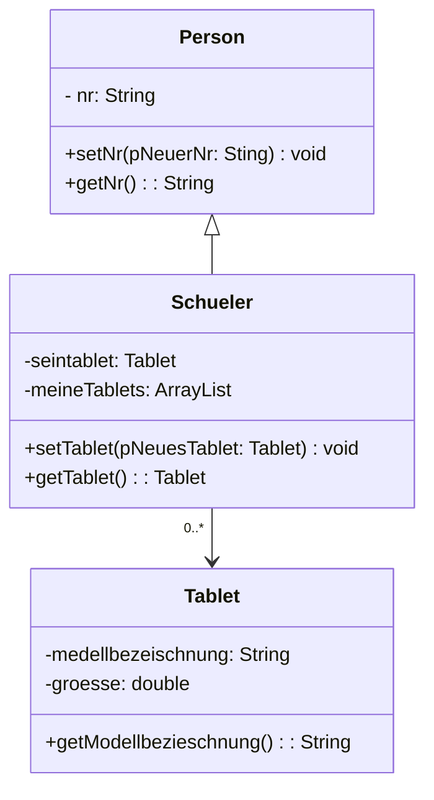

# UML

```mermaid
classDiagram

    class Person{
    - nr: String
    +setNr(pNeuerNr: Sting) void
    +getNr(): String
    
    }
    
    class Schueler {
    -seintablet: Tablet
    -meineTablets: ArrayList<Tablet>
    
    +setTablet(pNeuesTablet: Tablet) void
    +getTablet(): Tablet
    }
    
    class Tablet {
    -medellbezeischnung: String
    -groesse: double
    
    +getModellbezieschnung(): String
    }
    
    Schueler "0..*" --> Tablet
    Person <|-- Schueler
```

Schuler ist ist kind von Person \
Schueler kann 0 bis unendlich Tablets haben