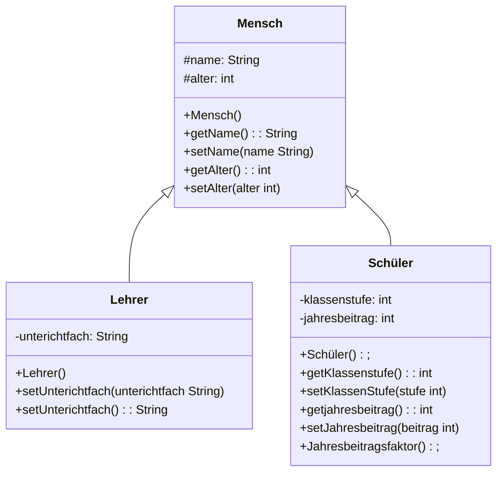

# KlassenDiagram

```mermaid
    classDiagram
    
    
    class Mensch {
    #name: String
    #alter: int
    +Mensch()
    +getName(): String
    +setName(name String)
    +getAlter(): int
    +setAlter(alter int)
    }
    
    class Lehrer {
    -unterichtfach: String
    +Lehrer()
    +setUnterichtfach(unterichtfach String)
    +setUnterichtfach(): String
    
    }
    
    class Schüler {
    -klassenstufe: int
    -jahresbeitrag: int
    +Schüler();
    +getKlassenstufe(): int
    +setKlassenStufe(stufe int)
    +getjahresbeitrag(): int
    +setJahresbeitrag(beitrag int)
    +Jahresbeitragsfaktor();
    }
    
    Mensch <|-- Lehrer
    Mensch <|-- Schüler
    
```