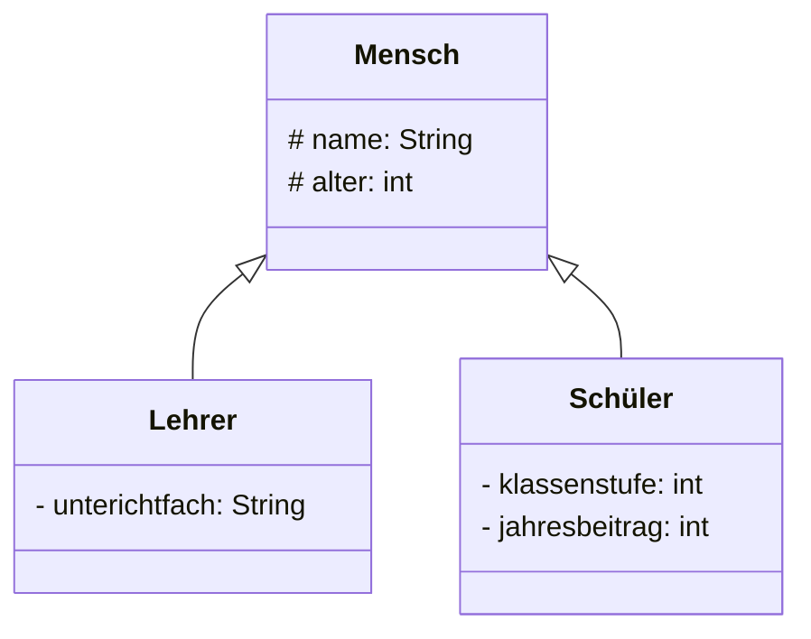

```mermaid
    classDiagram
    
    class Mensch {
    # name: String
    # alter: int
    }
    
    class Lehrer {
    - unterichtfach: String
    
    }
    
    class Schüler {
    - klassenstufe: int
    - jahresbeitrag: int
    }
    
    Mensch <|-- Lehrer
    Mensch <|-- Schüler
```